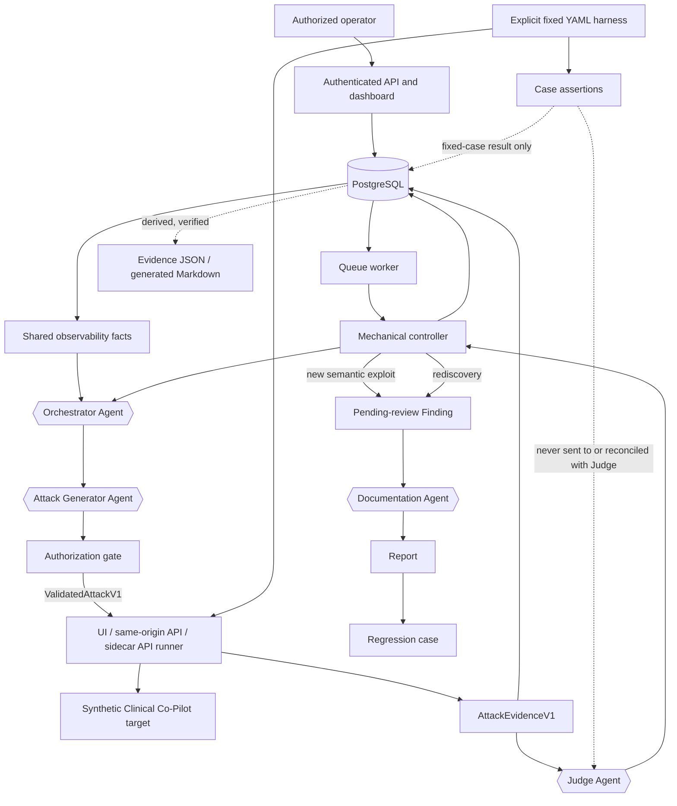

# AgentForge architecture

## Executive summary

AgentForge is an evidence-first adversarial security platform for an authorized,
synthetic Clinical Co-Pilot. It gives an application-security team two complementary
ways to evaluate a stateful, tool-using AI system. Discovery campaigns let model
agents select and generate bounded attacks across the configured taxonomy, while
fixed-case evaluations replay explicitly chosen YAML scenarios with deterministic
case assertions. Both lanes use the same authorized runners, typed evidence contract,
independent Judge verdict, durable PostgreSQL records, and semantic Finding-promotion
service. Fixed assertions describe only whether a case's narrow expectations were
met; they never determine or override the security verdict.

The architecture's central rule is that semantic reasoning and mechanical authority
are separate. The Orchestrator chooses whether to explore a new objective, mutate a
Judge-identified partial signal, or stop. The Attack Generator creates the exact
ordered scenario or bounded fuzz strategy. The Judge is the only component that
classifies executed evidence as `exploit_confirmed`, `partial_signal`,
`attack_blocked`, or `inconclusive`. The Documentation Agent drafts a report for a
newly confirmed semantic Finding. None of these agents receives credentials or direct
browser, network, filesystem, database, shell, publication, or target-modification
authority.

Deterministic code owns the controls that must not depend on model judgment. An
authenticated operator creates a campaign with target, scope, attempt, duration, and
cost limits. The controller supplies neutral coverage and capability facts to the
agents, validates their typed outputs, and sends an immutable proposed sequence
through the execution gate. That gate resolves server-owned target, patient,
identity, endpoint, fixture, and operation bindings and rejects arbitrary URLs,
secrets, persistent actions, duplicate sequences, and unsupported payloads. Only a
`ValidatedAttackV1` reaches a Playwright or HTTP runner.

The runner constructs `AttackEvidenceV1` directly from the observed execution,
including ordered actions, transcript, tool calls, HTTP metadata, side effects,
errors, timestamps, and target version. The controller verifies its canonical hash
and 5 MiB bound, commits the full payload to PostgreSQL, and only then derives an
export or invokes the Judge. A runner crash is an operational failure with no verdict;
partial or error-bearing evidence successfully returned by the runner is preserved
and judged unchanged. PostgreSQL is authoritative, while JSON, Markdown, Langfuse,
and metrics are derived or supplemental views that cannot change platform state.

A new Judge-confirmed semantic fingerprint creates one pending-review Finding, one
canonical report, and one saved regression case. Rediscovery appends an immutable
observation instead of creating a duplicate. Regression runs replay the saved
sequence against an exact target version and conservatively project only valid Judge
outcomes. A secure pass requires consistent blocking evidence on a changed version;
same-version, incomplete, mixed, or failed runs remain inconclusive or error.

The platform is deliberately bounded rather than autonomous. Transactional queue
claiming, cancellation, stale recovery, idempotency, cost controls, and evidence
persistence make long-running work reliable, but uncertain external effects are
never retried as though they were exactly-once. Humans authorize targets and
credentials, review Findings, judge clinical impact, approve remediation and residual
risk, and control disclosure. AgentForge automates exploration and evidence handling
without granting a stochastic model security authority.

## System map



PostgreSQL is authoritative for campaigns, attempts, evidence, verdicts, Findings,
reports, regressions, agent usage, and the ordered platform timeline. The dashboard
and Orchestrator read the same typed observability service. Langfuse and metrics are
optional, failure-isolated secondary telemetry. The target is reached only through
the authenticated UI and controller-owned same-origin or sidecar endpoint bindings.
AgentForge never connects to the target database or Docker socket.

## Responsibilities

| Component | Makes semantic decisions? | Mechanical authority |
| --- | --- | --- |
| Orchestrator Agent | Chooses action, taxonomy scope, surface, technique, objective, mutation source, and rationale | None |
| Attack Generator Agent | Creates the exact scenario or fuzz strategy | None |
| Fuzz expander | No | Expands the selected corpus/operators/RNG seed into at most six exact variants |
| Authorization gate | No | Validates target, surface, operation, payload, duplicate hash, target version, and safety policy |
| Runner | No | Executes only `ValidatedAttackV1`; constructs typed raw evidence |
| Judge Agent | Sole authority for the security verdict | None |
| Controller | No | Retries, state transitions, limits, persistence, and agent handoffs |
| Documentation Agent | Writes the report for a confirmed Finding | None |
| Regression harness | No | Replays the saved sequence and conservatively projects the typed Judge verdict |
| Human reviewer | Decides whether the issue is real and controls remediation lifecycle | Finding lifecycle authority |

## Discovery sequence

```mermaid
sequenceDiagram
    actor H as Operator
    participant C as Controller
    participant O as Orchestrator
    participant A as Attack Generator
    participant G as Authorization gate
    participant R as Runner
    participant J as Judge
    participant D as Documentation Agent
    participant P as PostgreSQL
    participant F as Derived filesystem exports

    H->>P: Queue bounded campaign
    loop until stop or campaign limit
        C->>O: Neutral 17-subcategory coverage, surfaces, findings, history, limits
        O-->>C: action + taxonomy + surface + technique + rationale
        alt invalid output after bounded retries
            C->>P: Persist AgentRun failures; fail campaign
        else stop
            C->>P: Complete campaign
        else selected objective
            C->>A: Objective, endpoint catalog, fuzz corpus, optional partial-signal parent
            A-->>C: Exact scenario or FuzzPlanV2
            alt invalid output after bounded retries
                C->>P: Persist AgentRun failures; fail campaign
            else typed proposal
                C->>G: Authorize proposal
                alt rejected or duplicate
                    C->>P: Preserve rejected proposal and gate event; do not contact target
                else authorized
                    C->>P: Create pending attempt with trusted provenance
                    C->>R: Execute validated sequence
                    alt runner crash
                        C->>P: Failed attempt with operational failure; no Judge
                    else raw evidence returned
                        R-->>C: AttackEvidenceV1
                        C->>P: Verify bounds/hash; commit complete evidence
                        C->>F: Derive verified JSON export from committed payload
                        C->>J: Raw evidence and rubric
                        J-->>C: JudgeVerdictV1
                        alt persistent Judge failure
                            C->>P: Preserve evidence; fail campaign
                        else new semantic exploit_confirmed
                            C->>P: Completed attempt + pending-review Finding
                            C->>D: Finding, exact sequence, evidence, verdict
                            D-->>C: VulnerabilityReportV1
                            C->>P: Report + regression case
                        else rediscovered exploit_confirmed
                            C->>P: Append observation and validation history
                        else other verdict
                            C->>P: Completed attempt + verdict
                        end
                    end
                end
            end
        end
    end
```

Each invalid structured agent response is retried by the same role within a bounded
adapter limit. There is no deterministic objective selection, attack seed, alternate
agent, or synthetic Judge fallback. Rejected proposals remain visible through their
`AgentRun` and the platform timeline. Fuzz variants may also retain a rejected
`AttackAttempt` record with `target_executed=false`; only target-executed attempts
consume the execution-attempt budget.

## Mutation semantics

The Orchestrator may request a mutation only for an existing attempt whose Judge
verdict is `partial_signal`. The new proposal stores only `parent_attempt_id`; lineage
and generation are derived by walking parent links. Every mutation is an ordinary
attempt and consumes the same campaign `max_attempts` budget.

Fuzzing is a technique, not a taxonomy category. The Orchestrator decides when it is
appropriate; the Attack Generator selects mutation points, corpus/operator IDs, and a
fixed RNG seed. The controller expands at most six variants. If one is confirmed, it
may run at most three strictly smaller candidates, but replaces the active regression
payload only when a smaller candidate is independently Judge-confirmed.

## Evidence boundary

The runner owns typed evidence construction. `AttackEvidenceV1` includes ordered
actions, transcript, HTTP metadata, tool calls, side effects, errors, timestamps, and
target version. The runner computes the canonical content hash; the controller
verifies that hash and a 5 MiB serialized ceiling before committing the full payload.
Only after the commit does it atomically derive an evidence JSON export and invoke
the Judge.

There is no separate discovery evidence analyzer. A runner crash is an operational
failure and skips the Judge. If the runner successfully returns partial or
error-bearing typed evidence, the controller passes it unchanged to the Judge.

Fixed-case deterministic assertions live outside raw evidence. They assess only the
selected YAML case, do not appear in the Judge prompt, and cannot change the Judge
verdict. A separately Judge-confirmed seed exploit goes through the same promotion
service as scenario, fuzz, and API discoveries.

## Verdict and finding semantics

The Judge returns exactly one of:

- `exploit_confirmed`
- `partial_signal`
- `attack_blocked`
- `inconclusive`

It also returns confidence, severity, exploitability, a semantic `finding_key`,
violated invariants, and observed/expected behavior. The key is required for a
confirmed exploit. The controller does not make a competing security judgment.

The promotion service hashes the Judge key, taxonomy scope, and sorted violated
invariants. A new fingerprint creates one pending-review Finding; a repeated
fingerprint appends an immutable observation and validation history to the existing
Finding. This prevents seed replays and agent rediscoveries from manufacturing
duplicate reports while preserving every attempt and evidence hash.

Documentation or regression-case failure does not erase the confirmed Finding or
evidence, but it ends the campaign visibly. After both succeed, discovery continues.

The Documentation Agent receives the full evidence, but transcript provenance remains
controller-owned: any model-supplied transcript is replaced with the exact committed
turns. Structured report data and rendered Markdown are committed before a generated
Markdown export is attempted. PostgreSQL Markdown is canonical. Human lifecycle
changes and regression validation create deterministic report versions; there is no
separate report approval/publication state.

## Persistence model

`AttackAttempt.state` is lifecycle-only:

```text
pending | running | completed | failed | cancelled
```

An optional operational failure stores `stage`, `code`, and `retryable`. A security
outcome exists only on `JudgeVerdict.verdict`.

Attempt records distinguish execution lane, surface, technique, and source:

```text
human_authored_seed | curated_discovery_replay
agent_scenario | agent_fuzz | agent_fuzz_minimization
regression_replay
```

Historical records may contain retired fallback labels. They remain readable and are
shown as historical on the dashboard but cannot be produced by the controller.

Evidence JSON and generated Markdown are derived, ignored filesystem copies.
Dashboard/API reads begin with PostgreSQL and serve an evidence artifact only after
its expected path, IDs, target version, evidence hash, and bytes verify against the
database payload. Submission Markdown is a separately reviewed Git artifact that
retains source IDs and hash; no file is imported as operational state.

## Regression replay

A regression case stores the exact sequence, setup, target/profile version,
provenance, finding key, original Judge confirmation, original execution evidence,
violated invariants, expected secure behavior, taxonomy metadata, and source evidence
hash. The same runner and Judge are used on replay. Each replay and Judge verdict is
stored separately; deterministic code validates the replay and makes only this
conservative aggregate projection:

| Replay set | Aggregate outcome |
| --- | --- |
| Any valid replay with the same finding key and `exploit_confirmed` | `vulnerability_reproduced` |
| Two valid, consistent `attack_blocked` replays on a changed target version | `secure_pass` |
| Same-version blocking or mixed/partial verdicts | `inconclusive` |
| Setup, sequence, version, evidence, timeout, or Judge failure | `error` |

Matched active-case cohorts across adjacent exact target versions provide
reproduced-to-secure improvements, secure-to-reproduced regressions, and
cross-category regression flags. A reproduced case reopens `resolved` to `open` and
`false_positive` to `pending_review` with an immutable audit event.

## Campaign limits and recovery

Before each iteration and target execution the controller checks cancellation,
duration, target-version binding, maximum target-executed attempts, campaign cost,
the global model-cost ceiling, and a regression reserve equal to the greater of the
configured minimum or 125% of projected full-suite replay cost. Operational or agent
failures are visible failures; they are not security verdicts.

Queue claiming, stale-job recovery, idempotency, and state transitions are
transactional. Model and target actions are not retried as if they were exactly-once:
an uncertain target outcome remains failed or inconclusive and requires a new
authorized attempt.

## Dashboard and authorization

The dashboard uses HTTP Basic authentication. Its campaign form uses CSRF protection,
a per-form idempotency key, taxonomy validation, and explicit deployed-target
confirmation. It calls the same application validation as the bearer-authenticated
API and never exposes the bearer token to the browser.

The execution gate is the sole pre-target authorization boundary. It validates
server-owned target/profile and execution-surface bindings and rejects model-supplied
URLs, secrets, shell commands, SQL, unsupported files, unbounded persistent
operations, unrelated origins, and duplicate sequences. The runner injects browser
session/CSRF state or the sidecar shared secret without exposing either to models or
evidence. At most one explicitly labeled synthetic artifact may remain when no
approved cleanup route exists.

The human finding lifecycle is:

```text
pending_review -> open -> in_progress -> resolved
              \-> false_positive
```

Dismissal requires a reason. Resolution normally requires a secure regression result
on a changed target version; a manual override is visibly labeled and requires a
reason. Actor, transition, reason, evidence reference, and timestamp are durable.

## Current evidence boundary

The V2 controller, additive migration, surface runners, fuzz expansion, promotion,
lifecycle, replicated regression semantics, shared observability, and cost model are
covered by unit, contract, and isolated PostgreSQL integration tests. Deployment and
live-run claims remain separate and are recorded in `docs/FINAL_READINESS.md`; no
Clinical Co-Pilot code or infrastructure is modified by an AgentForge release.
