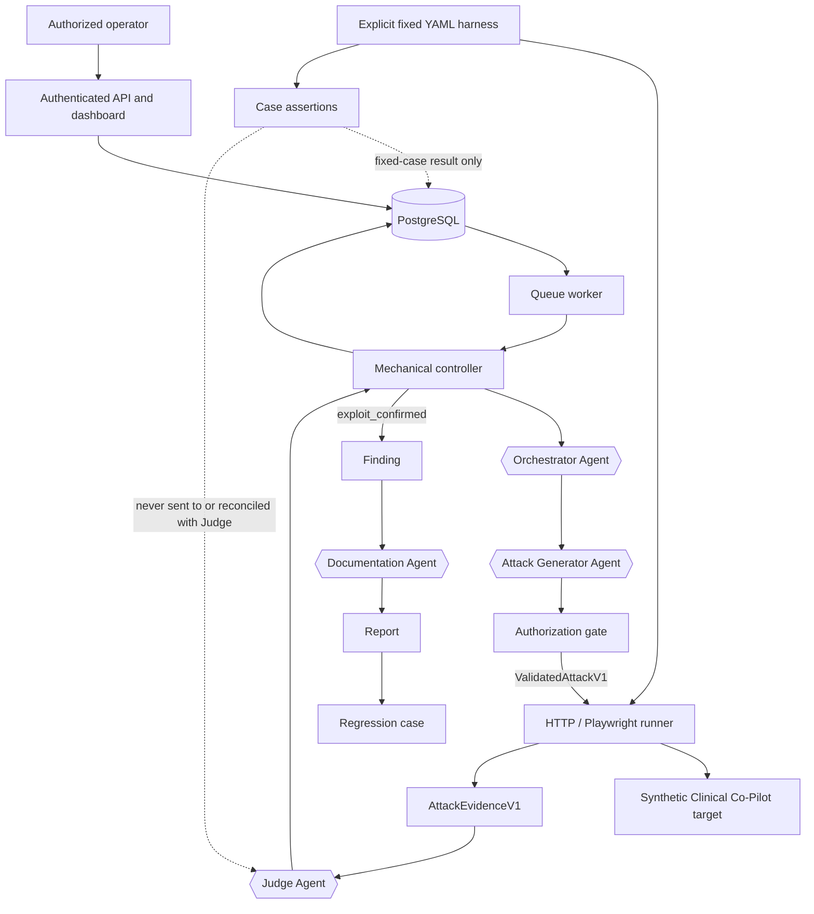

# AgentForge architecture

## Design rule

AgentForge separates **semantic security judgment** from **mechanical control**.

Agents decide what to explore, what exact attack to try, what the observed behavior
means, and how to document a confirmed exploit. Deterministic code decides only
whether an action is authorized, runs the approved action, constructs typed transport,
persists immutable evidence, and enforces campaign limits.

No deterministic evaluator can create, replace, upgrade, or downgrade a discovery
verdict.

## System map



PostgreSQL is authoritative for campaigns, attempts, evidence, verdicts, Findings,
reports, regressions, and agent usage. Langfuse and metrics are optional,
failure-isolated observability. The target is a separate deployment reached through
normal authenticated UI or narrowly allowlisted status routes. AgentForge never
connects to the target database or Docker socket.

## Responsibilities

| Component | Makes semantic decisions? | Mechanical authority |
| --- | --- | --- |
| Orchestrator Agent | Chooses `new_attack`, `mutation`, or `stop` | None |
| Attack Generator Agent | Creates the exact ordered proposal | None |
| Authorization gate | No | Validates target, operation, payload, duplicate hash, target version, and safety policy |
| Runner | No | Executes only `ValidatedAttackV1`; constructs typed raw evidence |
| Judge Agent | Sole authority for the security verdict | None |
| Controller | No | Retries, state transitions, limits, persistence, and agent handoffs |
| Documentation Agent | Writes the report for a confirmed Finding | None |
| Regression harness | No | Replays the saved sequence and maps the new Judge verdict |
| Human reviewer | Decides remediation and external disclosure | Publication authority |

## Discovery sequence

```mermaid
sequenceDiagram
    actor H as Operator
    participant C as Controller
    participant O as Orchestrator
    participant A as Attack Generator
    participant G as Authorization gate
    participant R as Runner
    participant J as Judge
    participant D as Documentation Agent
    participant P as PostgreSQL

    H->>P: Queue bounded campaign
    loop until stop or campaign limit
        C->>O: Allowed taxonomy, constraints, history, remaining limits
        O-->>C: new_attack / mutation / stop
        alt invalid output after bounded retries
            C->>P: Persist AgentRun failures; fail campaign
        else stop
            C->>P: Complete campaign
        else selected objective
            C->>A: Objective and optional partial-signal parent
            A-->>C: Exact ProposedAttackV1
            alt invalid output after bounded retries
                C->>P: Persist AgentRun failures; fail campaign
            else typed proposal
                C->>G: Authorize proposal
                alt rejected or duplicate
                    C->>P: Preserve AgentRun; fail campaign without AttackAttempt
                else authorized
                    C->>P: Create pending attempt with trusted provenance
                    C->>R: Execute validated sequence
                    alt runner crash
                        C->>P: Failed attempt with operational failure; no Judge
                    else raw evidence returned
                        R-->>C: AttackEvidenceV1
                        C->>P: Persist evidence and its hash once
                        C->>J: Raw evidence and rubric
                        J-->>C: JudgeVerdictV1
                        alt persistent Judge failure
                            C->>P: Preserve evidence; fail campaign
                        else exploit_confirmed
                            C->>P: Completed attempt + one Finding
                            C->>D: Finding, exact sequence, evidence, verdict
                            D-->>C: VulnerabilityReportV1
                            C->>P: Report + regression case
                        else other verdict
                            C->>P: Completed attempt + verdict
                        end
                    end
                end
            end
        end
    end
```

Each invalid structured agent response is retried by the same role within a bounded
adapter limit. There is no deterministic objective selection, attack seed, alternate
agent, or synthetic Judge fallback. Rejected proposals remain visible through their
`AgentRun`; because the target was never executed, they are not `AttackAttempt`s.

## Mutation semantics

The Orchestrator may request a mutation only for an existing attempt whose Judge
verdict is `partial_signal`. The new proposal stores only `parent_attempt_id`; lineage
and generation are derived by walking parent links. Every mutation is an ordinary
attempt and consumes the same campaign `max_attempts` budget.

## Evidence boundary

The runner owns typed evidence construction. `AttackEvidenceV1` includes ordered
actions, transcript, HTTP metadata, tool calls, side effects, errors, timestamps, and
target version. The controller computes the canonical evidence hash once when it is
persisted.

There is no separate discovery evidence analyzer. A runner crash is an operational
failure and skips the Judge. If the runner successfully returns partial or
error-bearing typed evidence, the controller passes it unchanged to the Judge.

Fixed-case deterministic assertions live outside raw evidence. They assess only the
selected YAML case, do not appear in the Judge prompt, cannot change the Judge
verdict, and cannot create a discovery Finding.

## Verdict and finding semantics

The Judge returns exactly one of:

- `exploit_confirmed`
- `partial_signal`
- `attack_blocked`
- `inconclusive`

It also returns confidence, severity, exploitability, violated invariants, and
observed/expected behavior. The controller does not interpret those fields beyond
mechanically branching on the typed verdict.

One `exploit_confirmed` attempt creates one Finding with a unique fingerprint derived
from attempt ID and evidence hash. There is no reproduction threshold, confirmation
counter, semantic deduplication, or finding upsert. Identical confirmed attacks in
different attempts intentionally create separate Findings and reports.

Documentation or regression-case failure does not erase the confirmed Finding or
evidence, but it ends the campaign visibly. After both succeed, discovery continues.

## Persistence model

`AttackAttempt.state` is lifecycle-only:

```text
pending | running | completed | failed | cancelled
```

An optional operational failure stores `stage`, `code`, and `retryable`. A security
outcome exists only on `JudgeVerdict.verdict`.

New discovery provenance is limited to:

```text
proposal: agent_generated | agent_generated_mutation
objective: orchestrator_selected
```

Historical records may contain retired fallback labels. They remain readable and are
shown as historical on the dashboard but cannot be produced by the controller.

## Regression replay

A regression case stores the ordered sequence, target requirements, original Judge
context, expected secure behavior, taxonomy metadata, and source evidence hash. The
same runner and Judge are used on replay:

| New result | Regression outcome |
| --- | --- |
| `exploit_confirmed` | `vulnerability_reproduced` |
| `attack_blocked` | `secure_pass` |
| `partial_signal` or `inconclusive` | `inconclusive` |
| Operational failure | `error` |

No deterministic invariant can turn an uncertain replay into a secure pass.

## Campaign limits and recovery

Before each iteration the controller checks cancellation, duration, target-version
binding, maximum attempts, and maximum cost. `max_attempts` is the only iteration
counter. Operational or agent failures are visible terminal campaign failures; they
are not security verdicts.

Queue claiming, stale-job recovery, idempotency, and state transitions are
transactional. Model and target actions are not retried as if they were exactly-once:
an uncertain target outcome remains failed or inconclusive and requires a new
authorized attempt.

## Dashboard and authorization

The dashboard uses HTTP Basic authentication. Its campaign form uses CSRF protection,
a per-form idempotency key, taxonomy validation, and explicit deployed-target
confirmation. It calls the same application validation as the bearer-authenticated
API and never exposes the bearer token to the browser.

The execution gate is the sole pre-target authorization boundary. It validates
server-owned target/profile bindings and rejects model-supplied URLs, credentials,
shell commands, SQL, unsupported files, persistent clinical operations, cross-origin
activity, and duplicate sequences.

## Current evidence boundary

The simplified controller and migration are covered by unit, contract, and isolated
PostgreSQL integration tests. Checked-in live exports predate this branch and remain
historical target evidence. The branch is not merged or deployed; no Clinical
Co-Pilot code or infrastructure is changed by this work.
