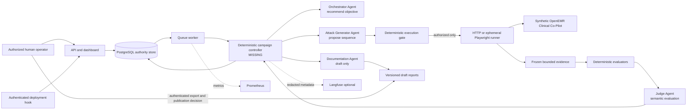

# AgentForge architecture

## Executive architecture narrative

AgentForge is designed as a **hub-and-spoke, stateful multi-agent campaign loop** for authorized security evaluation of one synthetic-data Clinical Co-Pilot. The important architectural distinction is that an LLM may recommend a goal, draft an attack, interpret frozen evidence, or write a report, but it may not choose a destination, hold target credentials, call the target, mutate campaign state, or publish a finding. Those powers belong to deterministic Python components operating over versioned Pydantic contracts.

Four independent model roles form the spokes. The Orchestrator recommends one bounded objective from controller-supplied taxonomy and budget context. The Attack Generator turns that objective into a typed `ProposedAttackV1`. A deterministic execution gate resolves symbolic endpoints and fixtures against the checked-in target profile, checks patient scope, methods, sequence bounds, uploads, cost, and prohibited operations, and either returns a typed rejection or `ValidatedAttackV1`. An HTTP or ephemeral Playwright runner is then meant to execute only that frozen authorization and produce `AttackEvidenceV1`. Deterministic evaluators inspect canaries, current-patient identity, side effects, evidence completeness, transport status, and resource bounds before the Judge interprets any semantic ambiguity. The controller, not the Judge, is meant to reconcile the result, apply stopping rules, update persistence, create or reopen a finding, and decide whether another mutation is allowed. The Documentation Agent receives a frozen confirmed finding and drafts a versioned report; export remains an authenticated, human-controlled action.

PostgreSQL is the authoritative campaign and audit store. Langfuse is optional, redacted telemetry: loss of Langfuse must not lose evidence or change a verdict. Prometheus metrics cover queue, worker, model, runner, and campaign health. Reports and bounded screenshots/transcripts are artifacts, not execution inputs. The target is a separate W1 OpenEMR deployment reached only through exact profile aliases and normal authenticated UI/PHP routes; AgentForge never connects to its database or Docker socket.

The repository currently implements the contracts, four one-turn agent adapters, target profile, deterministic gate, runners, deterministic evaluation, regression semantics, persistence models, API/dashboard application entrypoint, CLI, worker shell, telemetry, report rendering, CI jobs, and offline deterministic load script as separately tested components. It does **not** currently contain the concrete campaign controller/processor that wires the entire chain together; the default ASGI lifespan and standalone worker defer-import `agentforge.orchestration.controller`, which is absent. The runner interface also accepts `ProposedAttackV1` while the gate returns `ValidatedAttackV1`, so authorization-to-execution is not type-closed. Therefore this document describes both the intended design and the honest implementation boundary; no end-to-end campaign or W3 deployment is claimed.

Operationally, each campaign is intended to behave as a recoverable state machine rather than an open-ended chat. Every model invocation is one turn with bounded output, known pricing, typed success or failure, and minimal redacted trace metadata. Every target attempt belongs to an exact runtime build, profile, taxonomy, prompt, rubric, and evidence hash. Transport failure, missing evidence, target-version drift, stale session state, or incomplete cleanup produces a non-pass outcome. This makes replay and review possible without trusting the model's narrative. It also keeps the highest-risk decisions—whether an action is authorized, whether a deterministic boundary was crossed, whether work should continue, and whether a report leaves the system—within code and human governance that can be tested and audited independently.

## System map



## Responsibility and trust table

| Component | Inputs | Outputs | Trust and authority | Current state |
| --- | --- | --- | --- | --- |
| Orchestrator Agent | Taxonomy slice, coverage, limits, target version | `CampaignObjectiveV1` | Untrusted recommendation; no tools, credentials, handoffs, or target access | Implemented adapter; unit tested |
| Attack Generator Agent | Approved objective, remaining limits, profile-derived symbols | `ProposedAttackV1` | Untrusted proposal only | Implemented adapter; unit tested |
| Execution gate | Proposal plus controller-owned bindings, patient, fixtures, limits | `ValidatedAttackV1` or typed rejection | Sole pre-execution authorization boundary | Implemented and unit tested |
| HTTP runner | Status-only action sequence and execution context | `AttackEvidenceV1` | Exact status aliases; rejects chat and redirects | Implemented and unit tested |
| Playwright runner | UI action sequence, runtime credentials, ephemeral context | `AttackEvidenceV1` plus bounded artifacts | Normal OpenEMR session; no persisted browser state | Implemented with fake-browser tests; live runner not proven |
| Judge Agent | Frozen evidence, deterministic results, rubric | `JudgeVerdictV1` | Semantic assessor only; cannot override missing evidence into a pass | Implemented adapter and reconciliation logic; unit tested |
| Campaign controller | Campaign state, budgets, all typed outputs | State transition, next action, finding | Must be deterministic and authoritative | **Missing** |
| Documentation Agent | Frozen confirmed finding and evidence references | `VulnerabilityReportV1` draft | No publication authority or target access | Implemented adapter; not wired end to end |
| Regression harness | Versioned case and new evidence | secure pass, reproduced, inconclusive, or error | Exact sequence and affirmative-invariant semantics | Implemented pure evaluator; execution loop not wired |
| PostgreSQL | Versioned state and audit records | Transactional source of truth | Authoritative operational state | Models and one migration exist; migration not currently proven against a running DB |
| Langfuse | Redacted trace metadata | Debug/usage observations | Non-authoritative and failure-isolated | Adapter implemented; live credentials/export unverified |
| API/dashboard | Operator input and database reads | Queue records, views, exports | Mutations token-protected; reads currently open | Entrypoint and CLI exist and have SQLite-backed unit coverage; read auth is a blocker |

## Campaign sequence and communication

```mermaid
sequenceDiagram
    actor H as Human or deployment hook
    participant C as Deterministic controller
    participant O as Orchestrator
    participant A as Attack Generator
    participant G as Execution gate
    participant R as Runner
    participant E as Deterministic evaluator
    participant J as Judge
    participant D as Documentation Agent
    participant P as PostgreSQL

    H->>P: Queue bounded campaign
    C->>O: Taxonomy, coverage, target version, remaining budget
    O-->>C: Typed objective recommendation
    C->>A: Controller-approved objective and symbols
    A-->>C: ProposedAttackV1
    C->>G: Proposal plus authoritative bindings
    alt rejected
        G-->>C: Typed rejection
        C->>P: Record rejection and stop or choose next seed
    else authorized
        G-->>C: ValidatedAttackV1
        C->>R: Frozen authorization and ephemeral execution context
        R-->>C: AttackEvidenceV1
        C->>E: Evidence and declared invariants
        E-->>C: Deterministic result
        C->>J: Frozen evidence and deterministic result
        J-->>C: Semantic verdict
        C->>P: Reconciled outcome, usage, cost, trace IDs
        opt confirmed and reproducible
            C->>D: Frozen finding packet
            D-->>C: Versioned draft report
            C->>P: Store draft; await human disposition
        end
    end
```

Agents never talk directly to one another. The controller must serialize a role's structured output, validate it, store its run metadata, and construct the next role's minimal input. Target output is always quoted untrusted evidence, never a new instruction.

## Deterministic controls versus AI judgment

Deterministic code owns host and path allowlists, methods, synthetic patient identity, fixture hashes, upload staging/rejection, action order, request/response bounds, maximum attempts, duration, mutation depth, no-signal limits, token-cost reservation, queue state, cancellation, typed errors, evidence hashing, canary checks, persistent-side-effect checks, regression outcome rules, finding deduplication, and publication gates. These controls fail closed for execution and verdict confidence.

AI is used only where bounded language reasoning is useful: choosing a promising taxonomy objective, proposing a typed sequence from allowed symbols, interpreting semantic behavior after deterministic checks, and turning a confirmed record into readable remediation guidance. The Judge's high confidence cannot compensate for a timeout, absent evidence, unreadable response, wrong patient context, or failed cleanup.

## Budgets, stopping, and model routing

Default campaign ceilings are USD 2, 10 attempts, 1,200 seconds, three mutations, and four consecutive no-signal outcomes. The global configured ceiling is USD 10. A live call must have a known price, reserve maximum output before invocation, use one turn, and record usage. The controller should stop on cancellation, cost or time exhaustion, attempt exhaustion, mutation exhaustion, repeated no-signal, cleanup failure, target-version drift, or a confirmed high-impact result requiring human review.

The checked-in routing is Terra for Orchestrator, Attack Generator, and primary Judge; Luna for Documentation; and Sol only for a controller-approved ambiguous Judge escalation with reserved budget. This favors inexpensive structured work and reserves the stronger model for narrow adjudication. Model names, reasoning effort, output caps, and prices are configuration and must be refreshed before production use.

## Persistence, recovery, and observability

The worker claims queued campaigns transactionally, emits heartbeats, marks stale work interrupted, and sanitizes unexpected errors. A restart should recover only from persisted state; it must never guess whether a target side effect happened. If evidence or cleanup status is incomplete, the result is `inconclusive` or `error`, and a human must inspect the target before retrying.

PostgreSQL retains versioned attempts, verdicts, findings, reports, regression cases/runs/results, target versions, and agent-run usage. Langfuse receives redacted identifiers and metadata when configured; sensitive model inputs/outputs and tool definitions are hidden. Prometheus metrics support operational diagnosis but are not vulnerability evidence. See `docs/DATA_MODEL.md`, `docs/FAILURE_MODES.md`, and `docs/TRUST_BOUNDARIES.md`.

## Human gates

A human is required to authorize the target and synthetic identities, manage secrets, approve any persistent operation (disabled by default), review critical/high or clinically ambiguous findings, validate remediation, disposition false positives, and decide publication or external disclosure. No generated report is automatically sent anywhere.

## Design tradeoffs

- Plain deterministic Python makes the safety boundary auditable, but the missing controller requires deliberate implementation work.
- OpenAI Agents SDK provides typed single-turn model adapters and usage/tracing integration, while AgentForge intentionally does not give those agents tools or handoffs.
- Playwright reflects the real authenticated UI, but is slower and more selector-sensitive than HTTP; status checks stay on a small HTTP runner.
- PostgreSQL supports transactional workers and durable audit history, but introduces migrations and operational ownership.
- Langfuse improves trace correlation, but is intentionally optional and redacted so telemetry cannot become a correctness dependency.
- Fixed schemas reduce prompt flexibility but prevent free-form model output from becoming executable authority.

## AI-use disclosure

| Lifecycle step | AI used? | Model output can execute? | Deterministic/human control |
| --- | --- | --- | --- |
| Campaign objective suggestion | Yes | No | Controller selects or rejects |
| Attack sequence proposal | Yes | No | Gate validates every symbol and bound |
| Target execution | No | N/A | Deterministic runner only |
| Canary and boundary checks | No | N/A | Deterministic evaluator |
| Semantic evidence interpretation | Yes | No | Controller reconciles; missing evidence never passes |
| Finding/report draft | Yes | No | Versioned storage and human review |
| Export/publication | No | N/A | Authenticated human action |

## Current acceptance boundary

The API can be imported and the CLI help/application seams have unit coverage, but the default worker-enabled runtime is not a functioning campaign system: the concrete controller/processor, gate-to-runner authorization handoff, live integration tests, and authenticated read/dashboard routes remain incomplete. `OVERNIGHT_SUMMARY.md` is the source for the latest exact validation status.
