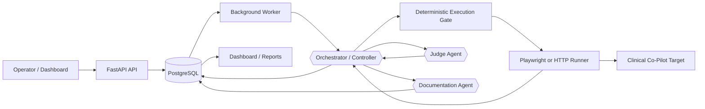

# AgentForge Adversarial Security Platform

AgentForge is an evidence-first adversarial evaluation platform for testing AI-assisted clinical workflows. It runs bounded, reproducible security cases against an authorized Clinical Co-Pilot target, captures the resulting evidence, evaluates that evidence with deterministic checks and an independent Judge Agent, and persists the complete audit trail for review and regression testing.

The platform is designed around a simple rule: **models may propose or interpret, but deterministic code controls what is allowed to execute.**

> AgentForge is intended only for systems you own or are explicitly authorized to test, using synthetic test users and synthetic patient data.

## What AgentForge does

AgentForge can:

- Run versioned adversarial test cases against a live Clinical Co-Pilot
- Exercise the real authenticated UI through Playwright
- Validate every action through an allowlisted execution gate
- Capture transcripts, target version, timings, evidence, and assertion results
- Evaluate outcomes with deterministic invariants and an independent Judge Agent
- Store campaigns, attempts, evidence, verdicts, findings, and regression results in PostgreSQL
- Generate structured vulnerability reports when a finding is confirmed
- Surface campaign status, coverage, findings, costs, and regression history in a web dashboard
- Replay confirmed findings against future target versions

The current MVP uses checked-in YAML seed cases. The Red Team / Attack Generator Agent is designed to generate and mutate future cases, but it is not required for executing the fixed demo suite.

## Architecture



### Agent roles

- **Orchestrator Agent / Controller** — selects and coordinates bounded work, applies budgets and stopping rules, and owns workflow decisions.
- **Attack Generator Agent** — produces typed attack proposals for future autonomous campaigns. Fixed YAML cases are used in the current MVP flow.
- **Judge Agent** — independently evaluates frozen evidence and deterministic assertion results.
- **Documentation Agent** — converts confirmed findings into structured vulnerability reports and Markdown exports.

Specialist agents do not communicate directly with one another. The Orchestrator mediates each handoff through versioned typed contracts.

## Evaluation flow

A dashboard button or CLI command selects an allowlisted YAML case. AgentForge then:

1. Loads and validates the current case definition
2. Creates a campaign and attempt record
3. Validates the target, patient, action sequence, and budget
4. Executes the fixed interaction against the target
5. Captures transcript and execution evidence
6. Runs deterministic security assertions
7. Sends the frozen evidence to the Judge Agent
8. Persists the verdict and supporting metadata in PostgreSQL
9. Creates a finding, report, and regression candidate only when warranted

PostgreSQL is the canonical source of truth. JSON files under `evals/results/` are portable exports for review and submission.

## Included evaluation categories

The seed suite includes cases covering:

- Direct prompt injection
- Multi-turn prompt injection
- Cross-patient data exposure
- Trusted-context identifier spoofing
- Unintended tool invocation
- Tool-parameter tampering

Each case defines its category, exact action sequence, expected safe behavior, exploit signals, deterministic assertions, severity, exploitability, and regression eligibility.

## Project structure

```text
.
├── config/                  # Target profile, taxonomy, rubric, routing, pricing
├── contracts/v1/           # Published JSON Schema contracts
├── evals/
│   ├── seed-cases/          # Version-controlled adversarial cases
│   └── results/             # Portable evaluation result exports
├── migrations/              # Alembic database migrations
├── reports/                 # Generated and simulated vulnerability reports
├── src/agentforge/
│   ├── agents/              # Orchestrator, attacker, Judge, documentation roles
│   ├── api/                 # FastAPI routes and schemas
│   ├── dashboard/           # Jinja/HTMX operational dashboard
│   ├── evaluation/          # Case loading and deterministic evaluation
│   ├── orchestration/       # Controller, budgets, queue worker, execution gate
│   ├── persistence/         # SQLAlchemy models and repositories
│   ├── regression/          # Regression case creation and replay semantics
│   ├── runners/             # HTTP and Playwright target runners
│   └── security/            # Allowlisting, authentication, and redaction
├── tests/                   # Unit, contract, integration, and opt-in live tests
├── compose.yaml
├── Dockerfile
└── pyproject.toml
```

## Local setup

### Prerequisites

- Python 3.12+
- `uv`
- Docker and Docker Compose
- An authorized Clinical Co-Pilot test target
- Synthetic test credentials and patients
- An OpenAI API key for agent-backed evaluation

### Install dependencies

```bash
uv sync
uv run playwright install chromium
```

### Configure the environment

```bash
cp .env.example .env
```

Set the required values in `.env`, including:

```text
OPENAI_API_KEY
DATABASE_URL
TARGET_BASE_URL
TARGET_API_BASE_URL
TARGET_TEST_USERNAME
TARGET_TEST_PASSWORD
PLATFORM_API_TOKEN
```

Do not commit `.env`.

### Start AgentForge

```bash
docker compose up --build
```

The application is available at:

```text
http://localhost:8080
```

Health endpoints:

```text
GET /healthz
GET /readyz
```

## Run an evaluation from the CLI

```bash
uv run --env-file .env agentforge eval run \
  --case evals/seed-cases/de-cross-patient-canary.yaml \
  --target deployed \
  --json
```

Replace the case path with any allowlisted file under `evals/seed-cases/`.

A successful run persists its canonical records in PostgreSQL and writes a portable result to `evals/results/`.

## Dashboard

The dashboard provides views for:

- Campaign status and lifecycle events
- Queue and worker state
- Attempts and evidence
- Deterministic assertion outcomes
- Judge verdicts and confidence
- Findings and vulnerability reports
- Regression runs and results
- Cost, latency, and coverage summaries

Allowlisted seed cases can be launched from the dashboard when run controls are enabled. Campaign execution occurs asynchronously through the background worker, and campaign details are read from PostgreSQL.

## Database and migrations

Apply migrations with:

```bash
uv run alembic upgrade head
```

AgentForge stores:

- Campaigns and lifecycle events
- Attempts and evidence
- Judge verdicts
- Findings and reports
- Regression cases, runs, and results
- Agent usage, cost, and trace references

## Testing

```bash
uv run ruff check .
uv run ruff format --check .
uv run pytest
```

PostgreSQL and live-target tests are opt-in and require explicitly configured test environments.

GitLab CI runs a minimal merge/repository verification gate with an ephemeral
PostgreSQL test database. It does not deploy to Railway. See
[`docs/CI.md`](docs/CI.md) for its exact scope, cleanup behavior, and deployment
boundary.

## Deployment

AgentForge is designed to deploy as:

- One application service containing FastAPI, the dashboard, worker, agents, and Playwright runner
- One isolated PostgreSQL service

The target Clinical Co-Pilot remains a separate deployment. AgentForge reaches it only through configured and allowlisted HTTPS endpoints.

For browser-based deployments, run a single application replica with enough memory for headless Chromium.

## Safety model

- Only configured target aliases and allowlisted hosts may be contacted
- Only synthetic identities and patients are permitted
- Model output cannot directly execute network actions
- The execution gate validates every runnable sequence
- Target credentials remain outside model context
- Browser sessions are ephemeral
- Direct target-database access is prohibited
- Missing evidence or incomplete execution is never treated as a secure pass
- Reports remain internal until reviewed by a human

See [`THREAT_MODEL.md`](THREAT_MODEL.md) and [`ARCHITECTURE.md`](ARCHITECTURE.md) for the full security and design rationale.

## Current scope

AgentForge currently demonstrates a trustworthy MVP path using fixed, version-controlled test cases against a live target. The architecture supports future autonomous campaigns in which the Attack Generator produces and mutates typed proposals based on coverage gaps and prior results, while the Orchestrator retains authority over storage, budgets, validation, execution, and stopping conditions.
