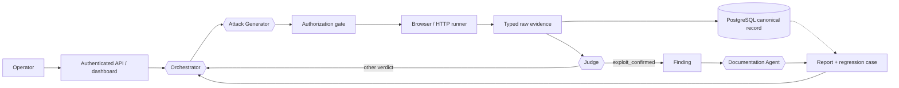

# AgentForge adversarial security platform

AgentForge is an evidence-first platform for testing an authorized Clinical
Co-Pilot with synthetic users and patient data. It supports two intentionally
separate workflows:

- **Discovery campaigns** use four agents to select, generate, judge, and document
  attacks. The Orchestrator receives neutral durable coverage facts for all 17
  taxonomy subcategories and chooses the category, surface, technique, objective,
  and mutation source. Deterministic code handles authorization, execution,
  persistence, budgets, and typed transport.
- **Fixed-case evaluations** run an explicitly selected YAML case with deterministic
  assertions. These are repeatable controls, not fallbacks for discovery. Their
  assertions never determine the security verdict, but a separately Judge-confirmed
  exploit enters the same finding-promotion path as any other attempt.

> Run AgentForge only against systems you own or are explicitly authorized to test.

## Discovery workflow



1. The Orchestrator receives compact PostgreSQL-backed coverage, supported and
   blocked surfaces, finding state, partial signals, prior families, and remaining
   limits. It returns `new_attack`, `mutation`, or `stop` plus its semantic rationale.
2. The Attack Generator creates the exact ordered scenario or a `FuzzPlanV2`.
   Deterministic fuzz expansion uses a versioned corpus and fixed RNG seed. A mutation
   must reference an existing `partial_signal` attempt.
3. The authorization gate checks only executable facts: allowed target, operation,
   payload, duplicate sequence hash, target version, and safety constraints.
4. The runner executes the validated sequence and directly constructs typed raw
   evidence.
5. The Judge is the sole authority for `exploit_confirmed`, `partial_signal`,
   `attack_blocked`, or `inconclusive`.
6. Every `exploit_confirmed` verdict carries a semantic finding key. A new semantic
   exploit creates a pending-review Finding, Documentation Agent report, and exact
   regression case; rediscovery appends evidence to the existing Finding. Discovery
   then continues until the Orchestrator stops or a configured limit is reached.

Invalid agent output receives bounded retries from the same agent. Persistent failure
ends the campaign visibly. There is no deterministic objective, attack, verdict, or
YAML fallback in discovery.

## State, verdicts, and provenance

An attempt's lifecycle is stored only as:

```text
pending | running | completed | failed | cancelled
```

Operational failures store `stage`, `code`, and `retryable`. Security meaning exists
only in `JudgeVerdict.verdict`; a failed runner therefore has no Judge verdict, while
partial or error-bearing evidence successfully returned by the runner is judged
unchanged.

New attempts preserve explicit lane and source provenance, including:

- `human_authored_seed` and `curated_discovery_replay`;
- `agent_scenario`, `agent_fuzz`, and `agent_fuzz_minimization`;
- `regression_replay`;
- proposal provenance `agent_generated` or `agent_generated_mutation`;
- objective provenance `orchestrator_selected`.

Historical fallback labels remain readable for audit compatibility but cannot be
created by the new controller. `parent_attempt_id` is stored for mutations; lineage
and generation are derived for display.

## Fixed-case and OWASP harness

YAML cases under `evals/seed-cases/` are launched explicitly from the CLI or dashboard.
Their deterministic assertions answer only the particular case's fixed expectations.
Raw runner evidence is sent directly to the Judge, and fixed assertions neither enter
the Judge prompt nor override its verdict. A Judge-confirmed seed exploit is promoted,
deduplicated, documented, and converted into a regression case through the same
service used by agent-generated scenarios, fuzz variants, and API attacks.

Portable result exports live under `evals/results/`; PostgreSQL remains the canonical
operational record.

For every executed discovery, regression, or fixed-case attempt, the complete bounded
sanitized transcript and structured evidence are committed to
`AttackAttempt.evidence_payload` before the Judge is invoked. A canonical JSON copy is
then exported to `artifacts/evidence/<campaign-id>/<attempt-id>.json`. The dashboard
and API load the PostgreSQL record first and serve the file only when its IDs, target
version, evidence hash, and serialized contents match. Files are never imported as
runtime state.

## Project structure

```text
.
├── config/                  # Target, taxonomy, fuzz, fixtures, routing, pricing
├── contracts/v1/           # Published JSON Schema contracts
├── evals/
│   ├── seed-cases/          # Explicit fixed-case and regression assets
│   └── results/             # Sanitized portable exports
├── migrations/              # Alembic migrations
├── reports/                 # Generated canonical vulnerability reports
├── src/agentforge/
│   ├── agents/              # Four structured model roles
│   ├── api/                 # FastAPI API
│   ├── dashboard/           # Authenticated Jinja/HTMX dashboard
│   ├── evaluation/          # Fixed-case harness
│   ├── observability/       # Shared Orchestrator/dashboard facts and cost model
│   ├── orchestration/       # Discovery controller and authorization gate
│   ├── persistence/         # SQLAlchemy models and repositories
│   ├── regression/          # Saved-sequence replay
│   ├── reports/             # Report rendering
│   ├── runners/             # HTTP and Playwright execution
│   └── security/            # Authentication, allowlisting, redaction
├── tests/
├── compose.yaml
├── Dockerfile
└── pyproject.toml
```

## Local setup

Requirements are Python 3.12+, `uv`, Docker, an authorized synthetic Clinical
Co-Pilot target, and provider credentials for agent-backed evaluation.

```bash
uv sync
uv run playwright install chromium
cp .env.example .env
docker compose up --build
```

Configure at least `OPENAI_API_KEY`, `DATABASE_URL`, target URLs and synthetic target
credentials, and `PLATFORM_API_TOKEN`. Never commit `.env`.

The application listens at `http://localhost:8080`; readiness is available at
`GET /readyz`.

## Run a fixed case

```bash
uv run --env-file .env agentforge eval run \
  --case evals/seed-cases/de-cross-patient-canary.yaml \
  --target deployed \
  --json
```

## Launch a discovery campaign

The authenticated `/dashboard/campaigns` page provides target, optional taxonomy
scope, maximum attempts, and maximum cost controls. Advanced controls provide
subcategory, duration, and queue priority. Deployed campaigns require an explicit
synthetic/authorized-target confirmation enforced server-side. The form is
CSRF-protected and idempotent and never embeds the platform bearer token.

Equivalent CLI:

```bash
uv run agentforge campaign create \
  --target deployed \
  --category prompt_injection \
  --max-attempts 1 \
  --max-cost-usd 0.25
```

The dashboard separates seeds, ordinary discovery, fuzz variants, and regression
replays; shows all taxonomy subcategories and execution surfaces; exposes finding
lifecycle controls and regression-suite launch; and renders a single ordered
controller/agent/runner timeline. Campaign details retain the exact ordered
user/assistant/tool/system transcript, evidence, Judge verdict, failure stage,
lineage, provenance, rationale, cost, and trace identity. Verified JSON can be
downloaded from the attempt panel.

Reconcile database records and local exports without modifying either:

```bash
uv run agentforge artifacts reconcile
```

Regenerate a missing export only from its matching PostgreSQL record:

```bash
uv run agentforge artifacts regenerate-evidence <campaign-id> <attempt-id>
```

## Database and tests

```bash
uv run alembic upgrade head
uv run ruff format --check .
uv run ruff check .
uv run pytest
uv run python scripts/export_contracts.py --check
uv run python scripts/export_evals.py --validate-only
```

PostgreSQL integration tests require an explicitly named `_test` database. Live-target
tests are opt-in. GitLab CI validates formatting, contracts, migrations, tests, and
submission artifacts without deploying; see [docs/CI.md](docs/CI.md).

## Safety and deployment boundary

- Only configured aliases, the two authorized deployed hosts, synthetic identities,
  synthetic patients, endpoint bindings, and approved document fixtures are
  authorized.
- A model cannot directly perform network, browser, file, shell, SQL, or publication
  actions.
- Target credentials never enter model context; browser contexts are ephemeral.
- Direct target-database access is prohibited. Persistent API operations are limited
  to one labeled synthetic artifact when no approved cleanup path exists; staged
  uploads otherwise use authenticated rejection cleanup.
- Incomplete execution is not a secure pass.
- Findings use one human lifecycle: `pending_review`, `open`, `in_progress`,
  `resolved`, or `false_positive`. Report publication is not a separate workflow.
- AgentForge and the Clinical Co-Pilot are separate deployments. Releasing this
  repository does not patch or reconfigure the target.

See [ARCHITECTURE.md](ARCHITECTURE.md), [THREAT_MODEL.md](THREAT_MODEL.md), and
[docs/FINAL_READINESS.md](docs/FINAL_READINESS.md) for the detailed design and
evidence boundaries.
