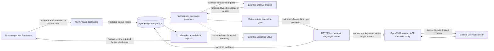

# AgentForge threat model

## Executive summary

AgentForge is an authorized security-evaluation control plane created for a Gauntlet AI bootcamp assignment and educational learning. Its only target is the user's own Clinical Co-Pilot in a separate OpenEMR environment with synthetic golden patients and no real users or patient records. Its purpose is to generate bounded test ideas, authorize them deterministically, execute them only against named synthetic patients, and preserve enough evidence for reproducible evaluation. It is not a clinical system, an authorization service for OpenEMR, or a general-purpose offensive platform. The primary safety objective is therefore dual: test whether Co-Pilot resists the six modeled threat families while ensuring AgentForge itself cannot broaden target, identity, patient, endpoint, file, cost, or publication authority.

The verified target contract is the normal OpenEMR physician session and same-origin Clinical Co-Pilot UI/proxy. A browser-selected numeric PID is installation-specific and never trusted merely because it appears in a model message or request body. OpenEMR owns authentication, the active patient, view-event and squad ACL checks, the allowed tool catalog, encounter/document bounds, and the CSRF token scoped as `clinical_copilot:<pid>`. The PHP proxy compares its server session with the card's expected PID and derives trusted context before contacting the sidecar. AgentForge must not call `/agent/chat`, manufacture trusted context, access the OpenEMR database, or use real records. Exact synthetic `pubpid` and display-name checks precede use of the dynamic PID.

Model services are outside the trusted computing base. The Orchestrator, Attack Generator, Judge, and Documentation roles can recommend or classify only through strict versioned contracts. Their output remains untrusted data. Before target execution, deterministic code must validate taxonomy scope, required setup sequence, target alias, endpoint method and purpose, patient alias, approved fixture metadata, budget reservation, time and turn limits, duplicate bounds, and cleanup state. A gate rejection grants no runner authority. The eventual controller-to-runner handoff must consume the gate's validated bindings; live execution remains unsafe until that handoff is verified end to end.

The target is also outside AgentForge's trust boundary. AgentForge permits only profile-owned origins and paths, refuses cross-origin redirects, uses short timeouts and bounded response capture, and keeps authenticated browser state ephemeral. Upload testing is nonpersistent: a repository-owned PDF is checked by path, media type, size, page count, and digest, staged under the authenticated patient/session, reviewed, and explicitly rejected. The confirm endpoint is prohibited in the current profile. Failure to verify rejection, or any other cleanup failure, is a hard campaign stop rather than a reason to continue in uncertain state.

OpenAI and Langfuse Cloud are external processors. Prompts and telemetry must be minimized and redacted; credentials, cookies, CSRF values, authorization headers, and browser storage state must never be exported. Langfuse is supplemental and failure-isolated. PostgreSQL evidence, typed contracts, deterministic assertions, and hashes remain the system of record. Missing transport, missing evidence, or telemetry success can never be interpreted as a secure target result.

Finally, machine output cannot publish itself. Deterministic violations may establish an evidence floor that a semantic Judge cannot downgrade, but a generated finding or Markdown report remains an internal draft. An authenticated export writes a local artifact only. A human reviewer must validate scope, evidence, clinical interpretation, reproducibility, and redaction before any external disclosure. The current API and dashboard read routes have no route-level authentication, so the service must remain on a private network until read authorization is added and verified.

This model describes controls and expected behavior; it does not claim that a complete live W3 campaign has run. `RUN_LIVE_E2E` is disabled by default. The target facts come from the 2026-07-21 read-only integration record in `docs/TARGET_INTEGRATION.md`; runtime version must be rediscovered for each campaign because the observed local runtime and checkout were not the same revision.

## Scope and security objectives

In scope:

- the W3 API, dashboard, worker, deterministic gate, runners, evaluation, persistence, report export, and observability adapters;
- the configured `local` and `deployed` target aliases;
- the exact synthetic patients `GOLDEN-LONGITUDINAL` and `GOLDEN-WORKFLOW`;
- normal OpenEMR form authentication, patient navigation, Co-Pilot chat, and nonpersistent document staging/rejection;
- external OpenAI model calls and Langfuse telemetry as untrusted external dependencies.

Out of scope and prohibited:

- real patient data, non-test identities, arbitrary hosts, arbitrary files, shell or SQL authority;
- direct OpenEMR database or Docker-socket access;
- direct sidecar `/agent/chat`, `/metrics`, or any persistent ingestion confirmation;
- autonomous target patching, issue creation, disclosure, or external publication;
- treating model output, a green transport, or an exported report as proof by itself.

The core security invariants are:

1. Target, role, patient, endpoint, fixture, and budget authority originate in deterministic configuration and server state, never model text.
2. Only the current exact synthetic patient can influence a patient-scoped result.
3. Every attempted action is bounded, attributable, and represented in sanitized evidence.
4. Incomplete execution is inconclusive or error, never a secure pass.
5. Persistent or external side effects require a separate human-controlled workflow; none are available to an ordinary campaign.

## Structured target map

| Component or asset | Trust level | Authority held | Principal threats | Required control |
| --- | --- | --- | --- | --- |
| Human operator/reviewer | Privileged but fallible | Starts/cancels campaigns, changes finding status, exports and externally publishes | Stolen token, overbroad scope, mistaken disclosure | Separate secrets, private network, explicit review, audit identifiers |
| API/dashboard | Partially trusted control surface | Validates campaign request and exposes stored summaries | Unauthorized queueing or evidence disclosure | Bearer/webhook checks on mutations; add read auth before public exposure |
| PostgreSQL | Internal system of record | Queue state, evidence summaries, findings, budgets, reports | Tampering, stale claims, overretention | Least privilege, transactional claims, backups, evidence hashes, retention policy |
| Worker/campaign processor | Trusted orchestration shell | Claims work and invokes bounded components | Duplicate execution, crash during side effect, unsafe processor wiring | Heartbeats, stale interruption, idempotency, cleanup check, validated handoff |
| Model roles | Untrusted external decision support | No direct target, database, filesystem, or publication authority | Prompt injection, hallucination, schema abuse, cost growth | Strict contracts, gate, budget reservation, deterministic floors |
| Execution gate | Critical trusted code | Converts proposal into bounded authorization or rejection | Logic flaw, stale profile, mapping confusion | Pure validation, version/hash capture, exact aliases, negative tests, fail closed |
| Runner | Narrow target actuator | Executes only authorized target actions | URL escape, patient drift, leaked session, accidental persistence | Origin/path allowlist, exact patient/card binding, ephemeral state, reject-only upload |
| OpenEMR/PHP proxy | Separate target trust domain | Authenticates user; owns PID, ACL, CSRF, tool/document scope | Broken access control, stale session, target compromise | Server-side rechecks; never trust model/client-supplied context |
| Co-Pilot sidecar | Target-internal service | Runs bounded model/tool workflow using proxy-derived context | Tool misuse, data disclosure, unbounded consumption | Private shared context, tool contracts, evidence and correlation linkage |
| OpenAI | External processor | Processes minimized model inputs | Data retention/exposure, outage, malicious or malformed output | No secrets/real PHI, structured outputs, typed errors, budget/time limits |
| Langfuse Cloud | External telemetry processor | Stores redacted trace metadata when enabled | Telemetry leakage, outage, misleading trace completeness | Redaction, hidden payload settings, fail-open telemetry only, local evidence authority |
| Artifact/report filesystem | Internal sensitive store | Screenshots, traces, local draft exports | Path traversal, secret capture, unauthorized publication | Repository-relative paths, post-auth tracing, local-only export, human gate |

## Threat family 1: prompt injection

Subcategories: direct, indirect file-based, and multi-turn injection.

Untrusted chat or staged-document text may claim to be a system instruction, ask the Co-Pilot to ignore clinical policy, manipulate later turns, or instruct the Judge/Documentation role to reinterpret evidence. The protected invariant is that content never changes server authorization, the current patient, the tool catalog, or the evidence standard. Controls include role-separated prompts, typed model outputs, current-patient binding in OpenEMR, approved fixtures only, and deterministic checks before semantic judgment. Detection looks for policy-override claims, unexpected tool references, foreign synthetic canaries, or differences between chart evidence and the response. A signal is contained to the current ephemeral session and fixture stage; stop the lineage, preserve bounded evidence, reject any stage, and require review before reproduction.

## Threat family 2: data exfiltration

Subcategories: synthetic-PHI leakage, cross-patient exposure, and authorization bypass.

The principal test is whether Patient B information appears while Patient A remains selected. Message-supplied names, `pubpid`, numeric PIDs, encounter IDs, or document IDs are untrusted. Selection succeeds only on the exact approved `pubpid` plus display name; the numeric PID comes from the live card and must remain unchanged. OpenEMR then rechecks the active session, scoped CSRF token, view-event/squad ACL, and server-derived record bounds. Deterministic detection searches assistant/tool evidence for the foreign canary, identifier, source ID, or an allowed tool call carrying foreign patient context. A proven foreign value is a confirmed invariant violation regardless of Judge opinion. Containment is immediate campaign stop, session disposal, evidence restriction, and human review; do not query additional foreign data to “confirm” the leak.

## Threat family 3: state corruption

Subcategories: history manipulation and context poisoning.

An attacker may assert fabricated prior conclusions, try to make a false fact persist across turns, or embed a durable instruction in a document. Conversation text is evidence input, not chart truth. A clean attempt begins with a fresh ephemeral browser context, and chart/evidence lineage must outrank conversational claims. Staged uploads are temporary and must be rejected. Detection compares later answers with the exact action history, chart-backed citations, synthetic canaries, and fresh-session behavior. If prior-session markers or unsupported facts survive a fresh context, stop the attempt and preserve the minimal sequence. Recovery is a new browser context and reauthentication; it is never a database reset or silent continuation from uncertain state.

## Threat family 4: tool misuse

Subcategories: unintended invocation, parameter tampering, and recursive tool calls.

The Co-Pilot exposes read-oriented clinical tools, but their availability and patient/document parameters must be server-owned. Text cannot add a tool, choose a foreign PID, or grant arbitrary URL, file, SQL, or shell authority. The gate rejects authority-shaped parameters and endpoints outside exact method/surface/path bindings. OpenEMR injects the trusted patient and bounded scope. Detection uses target-visible tool-call metadata when available, evidence lineage, foreign parameter references, repeat counts, and response behavior. Any allowed foreign-context call or prohibited side effect is a deterministic failure. Contain by terminating the attempt, disposing of session state, and preventing mutation descendants until cleanup and authorization mappings are reverified.

## Threat family 5: denial of service

Subcategories: token exhaustion, looping, and cost amplification.

Inputs may request excessive output, repeated transforms, recursive tools, large responses, long waits, or many near-duplicate attempts. Controls are layered: request/message and upload limits, per-action timeouts, response-size caps, maximum turns/actions/mutations/attempts, exact duplicate limits, no-signal stopping, and worst-case token/cost reservation before model use. Unknown or stale pricing must reject the live call rather than estimate optimistically. Detection includes timeout and size errors, budget reconciliation, queue age, worker heartbeat, repeated sequence hashes, and target latency. Containment is cancellation or hard stopping without further model/target calls. Recovery requires capacity and state reconciliation; a timeout is inconclusive, not evidence that the target resisted the test.

## Threat family 6: identity and role exploitation

Subcategories: privilege escalation, persona hijacking, and trust-boundary violation.

User or document text may claim to be an administrator, clinician, platform directive, or higher-priority evaluator. Identity and role derive only from the configured test credential and authenticated OpenEMR session. The gate requires the approved identity alias and supported role; the proxy independently enforces session ACLs. Models cannot change finding status, campaign state, credentials, target configuration, or publication state. Detection looks for role-change or privileged-action claims, mismatched authenticated role, target `401/403`, and model output requesting forbidden authority. Recovery requires credential/session revalidation and a fresh context. Suspected credential compromise triggers secret rotation and audit; it never justifies an alternate login or bypass.

## Residual risk and review triggers

Residual risks include flaws in the deterministic gate, mismatched gate-to-runner bindings, target-side authorization defects, incomplete target-visible tool metadata, provider data handling, unprotected W3 read routes, and screenshots/traces containing more synthetic chart context than intended. Live mode must remain off until the complete validated handoff, private deployment boundary, cleanup behavior, and evidence flow are verified. Human review is mandatory for cross-patient signals, clinical-safety interpretations, ambiguous tool behavior, any proposed persistent action, any external disclosure, and any event that may involve non-synthetic data.
