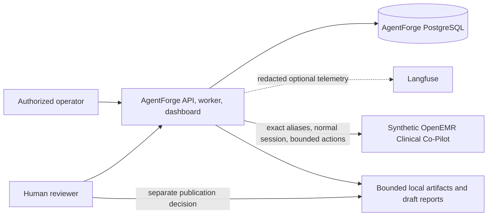

# Authorization to Operate evidence packet

## Packet status

**Engineering evidence draft; not an ATO and not approval to operate.** This packet describes repository evidence as of 2026-07-21. It contains explicit missing and unverified items. The system must remain private and synthetic-only until the security owner accepts residual risk and the executable path, deployment, authentication, scans, backup/restore, and incident controls are independently verified.

## System and authorization boundary

AgentForge is an educational, owner-authorized evaluator for one synthetic OpenEMR Clinical Co-Pilot. It has no authorization for real PHI, real users, other hosts, arbitrary URLs, target database access, persistent browser state, or shell execution. The target profile prohibits direct `/agent/chat`, `/metrics`, and ingestion confirmation. See `THREAT_MODEL.md`, `docs/TRUST_BOUNDARIES.md`, and `docs/TARGET_INTEGRATION.md`.

## Evidence index

| Control area | Repository evidence | Status |
| --- | --- | --- |
| Architecture/data flow | `ARCHITECTURE.md`, `docs/DATA_MODEL.md` | Documented; end-to-end controller missing |
| Threat/trust model | `THREAT_MODEL.md`, `docs/TRUST_BOUNDARIES.md` | Documented |
| Authentication/authorization | `docs/AUTH_MODEL.md`, `src/agentforge/api/routes.py`, target profile | Mutation/webhook checks implemented; read/dashboard auth gap |
| Target authorization | `config/target-profile.yaml`, `docs/TARGET_INTEGRATION.md` | Profile and read-only baseline documented; live W3 execution unverified |
| Dependency inventory | `pyproject.toml`, `uv.lock`, `docs/DEPENDENCIES.md` | Locked inventory exists; vulnerability/license scan missing |
| Schema/migrations | `src/agentforge/persistence/models.py`, migration `1b98633917fc` | Implemented; live migration verification pending |
| Contract/test evidence | `contracts/v1`, `tests/`, `docs/integration/CONTRACT_TEST_RESULT.md` | Unit/contract evidence only; integration/E2E missing |
| Deterministic execution authorization | `orchestration/execution_gate.py`, gate tests | Implemented in isolation; gate-to-runner type closure missing |
| Target runners | HTTP/Playwright modules and unit tests | Implemented with fakes/mocks; authorized live runner not proven |
| Evidence/verdict/regression | evaluation/regression modules and tests | Pure semantics implemented; campaign integration missing |
| Audit and telemetry | persistence models, Langfuse/Prometheus adapters | Implemented in isolation; live backend proof missing |
| Deployment | Dockerfile, Compose, Railway configuration, ASGI entrypoint and CLI | Declared and importable; default worker needs absent controller; no W3 deployment evidence |
| Incident response | `docs/FAILURE_MODES.md` and simulated postmortem below | Runbook concepts documented; exercise not performed |
| Load/capacity | `docs/LOAD_TEST.md`, `AI_COST_ANALYSIS.md` | 100-operation in-process deterministic microbenchmark recorded; full platform and live capacity unmeasured |

## Authentication and access-control evidence

Write-like API operations require a constant-time Bearer token comparison; the deployment hook uses a distinct header secret. OpenEMR authentication uses a normal physician form session, dynamic server-owned patient context, patient-scoped CSRF, and ACL rechecks. Secrets are expected only in runtime environment/secret stores.

Material gap: campaign, finding, report, coverage, agent-run, regression-read routes and dashboard HTML currently have no route authentication. Loopback Compose binding reduces local exposure but does not protect a public Railway deployment. This is a release blocker, not an accepted control.

## Versioned dependency and platform-scan evidence

`uv.lock` pins resolved packages; `Dockerfile` pins the uv image tag and uses `python:3.12-slim`, while Compose uses `postgres:17-alpine` without a patch/digest pin. No SBOM, SAST, SCA, secret scan, container scan, DAST result, or license report is checked in. No claim of a clean scan is made. Required evidence before ATO:

- generate an SBOM from the locked environment and container;
- run secret detection, SAST, dependency vulnerability, license, and container-image scans;
- triage all material results with evidence and expiration dates;
- pin production images by maintained patch or digest and document update ownership;
- run separately scoped conventional DAST only against the synthetic target.

## Test evidence

The exact latest local checks and limitations belong in `OVERNIGHT_SUMMARY.md` and `docs/integration/CONTRACT_TEST_RESULT.md`. Unit and contract tests do not prove PostgreSQL migration, app startup, target authentication, live model calls, Langfuse export, full campaign execution, regression replay, or Railway behavior. Live E2E is opt-in and must never be inferred from a default test pass.

## Sample incident/postmortem — SIMULATED ONLY

**Scenario:** A hypothetical public W3 deployment exposes an unauthenticated finding-read route. A non-authorized visitor reads a synthetic vulnerability draft. This did not occur and is included only to exercise response structure.

**Detection:** Access-log anomaly and an unexpected read count alert identify requests without an authenticated principal. The operator disables public routing and preserves logs, target version, image digest, database snapshot, and trace correlations.

**Containment:** Stop API/worker replicas, revoke platform/webhook/model/telemetry credentials, restrict ingress to the incident team, and confirm that no target-side session or persistent stage remains. Do not delete records during containment.

**Impact assessment:** Determine exact routes, records, source addresses, deployment versions, duration, and whether any secrets or non-synthetic data were present. The intended boundary forbids real PHI; evidence must verify rather than assume that boundary held.

**Root cause:** Read routes and dashboard were designed for a local loopback demo and were deployed without an external authorization layer. Configuration was treated as equivalent to application enforcement.

**Remediation:** Require authentication and authorization on every non-health route, add negative tests, disable dashboard by default, set private ingress, rotate secrets, add deployment policy checks, and verify logs/redaction. Reopen only after independent review.

**Lessons:** Local network binding is not a production access-control model; an ATO packet must test deployed behavior, not merely inspect route code.

## Residual-risk register

| Risk | Current disposition | Exit criterion |
| --- | --- | --- |
| Missing concrete controller/processor | Block release | Runnable deterministic chain with integration tests |
| Gate output not enforced by runner type | Block live execution | Runner accepts only a frozen authorized envelope and negative bypass tests pass |
| Unauthenticated reads/dashboard | Block public deployment | Principal-based access on all non-health routes plus deployed negative checks |
| No live DB/migration/backup proof | Block production data reliance | Upgrade/rollback policy, backup and restore exercise |
| No software/container scans | Block ATO | Versioned scan reports and triage |
| No authorized W3 E2E | Block vulnerability claims | One bounded synthetic trace with cleanup and exact target build |
| Stochastic false positive/negative | Human review required | Calibrated corpus, reproduction rules, periodic adjudication audit |
| Third-party model/telemetry exposure | Minimize and contractually review | Data-flow review, retention controls, redaction test, vendor configuration evidence |
| Selector/target drift | Fail closed | Version refresh, contract smoke, exact patient/card checks |
| Missing retention/tenant controls | Keep single-owner private | Approved retention, encryption, access, purge, and audit policy |

## Authorization decision checklist

- [ ] Named system owner and security authorizer.
- [ ] Exact deployment URL, revision, image digest, and target alias recorded.
- [ ] All non-health routes authenticated and least-privileged.
- [ ] Secrets in a managed store with rotation and no logs.
- [ ] Migration, backup, restore, failover, and stale-worker recovery verified.
- [ ] Unit, contract, integration, E2E, regression, and negative authorization tests pass.
- [ ] SBOM/SAST/SCA/secrets/container/DAST results triaged.
- [ ] Load, cost ceiling, rate limits, and target concurrency verified.
- [ ] Langfuse and model data controls reviewed.
- [ ] Incident runbook exercised.
- [ ] Residual risks accepted in writing.

Until every required item is evidenced, the correct decision is **not authorized for public or clinical operation**.
