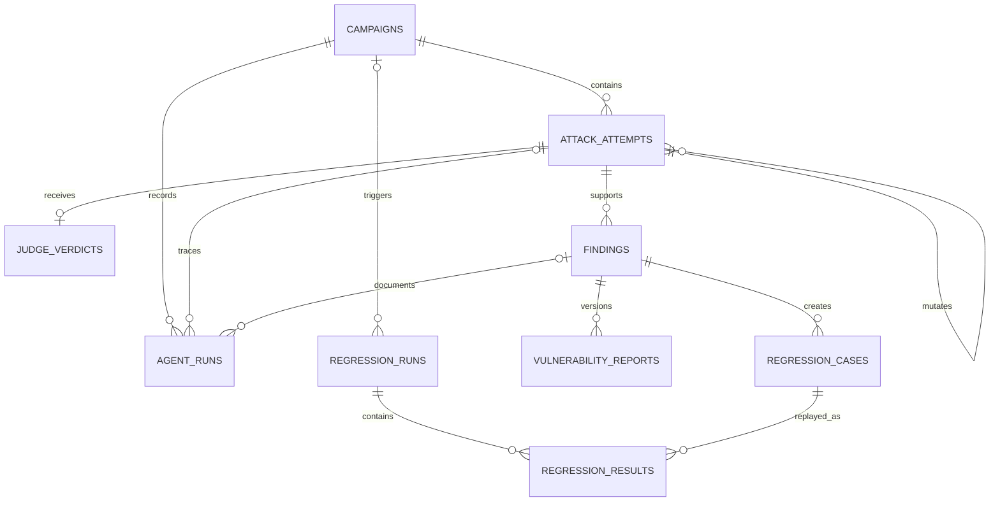

# AgentForge data model

## Authority and revision

PostgreSQL is the operational source of truth. The current schema is represented by SQLAlchemy models and Alembic head `c71d9e5a4b20`. Empty-database upgrade/current/check and the explicit PostgreSQL integration suite have been exercised, and the deployed database persisted live campaign, attempt, assertion, Judge, AgentRun, usage, cost, latency, trace, and terminal records.

## Tables

| Table | Purpose and important fields | Integrity/lifecycle |
| --- | --- | --- |
| `target_versions` | Environment, version label, Git SHA, deployment ID, URL alias, profile hash, metadata | Unique version label; records exact evaluated runtime, not assumed checkout HEAD |
| `campaigns` | Type/trigger/status, target alias/version, category scope, budgets, attempts, priority, heartbeat, cancellation, sanitized error | Unique idempotency key; indexed queue/status/category/version; parent for attempts and agent runs |
| `attack_attempts` | Family/parent/mutation generation, objective, proposed/executed sequences, prompt/taxonomy/profile versions, evidence hash, usage/cost/latency/trace | Cascades with campaign; self-parent becomes null; immutable evidence identity should be treated append-only after completion |
| `judge_verdicts` | Verdict, severity, exploitability, confidence, evidence references, violated invariants, rubric version/hash, deterministic override | Exactly zero or one per attempt; cascades with attempt |
| `findings` | Stable vulnerability ID/fingerprint, source attempt, category/severity/status, clinical impact, expected/observed behavior, first/last target versions | Fingerprint and vulnerability ID unique; source attempt restricted from deletion; current regression pointer optional |
| `vulnerability_reports` | Finding/version, structured report, Markdown, export path, draft status, validation summary, prompt/schema versions | Unique finding/version; cascades with finding; export path is metadata, not evidence authority |
| `regression_cases` | Finding/version, setup, exact ordered sequence, invariants, deterministic checks, rubric subset, target requirements, source evidence hash | Unique finding/version; versioned rather than edited in place |
| `regression_runs` | Target version, optional campaign, trigger/status, outcome counters, cost and timing | Campaign deletion sets null; results cascade |
| `regression_results` | Run/case/version, four-state outcome, deterministic/Judge results, evidence references, cost/latency/trace | Unique run/case/version; case deletion restricted |
| `agent_runs` | Role, prompt version, model, status, tokens, cost, latency, trace ID, typed error, campaign/attempt/finding links | Links set null on parent removal; supports audit and cost measurement |

## State rules

Campaign states should be changed only by repository/controller transitions. Queue claiming and heartbeat recovery are transactional. A cancelled or stale run becomes an explicit terminal/interrupted record, not silently retried. Attempts retain proposal, actual execution, versions, and frozen evidence separately. Findings are deduplicated by fingerprint and progress through human-controlled status. Reports and regression cases are new versions, not destructive updates.

Regression outcomes are `secure_pass`, `vulnerability_reproduced`, `inconclusive`, or `error`. A secure pass requires affirmative evidence for every saved invariant; a transport failure or missing Judge result for a Judge-required case cannot pass.

## JSON/JSONB fields

Flexible contracts are stored as JSON with a PostgreSQL JSONB variant. This supports versioned typed payloads but shifts some integrity to Pydantic and application code. Every stored contract should carry `schema_version`, source/prompt/profile/rubric versions where relevant, and hashes for evidence or configuration. Migrations must accompany incompatible shape changes; free-form secrets or raw headers must never be stored.

## Sensitive data and retention

The system is synthetic-only but still handles credentials, session cookies, CSRF values, prompts, target responses, and potentially sensitive implementation details. Credentials and session artifacts belong only in process memory/secret stores and must be redacted before database, logs, Langfuse, screenshots, or reports. Evidence should be bounded to required canaries, target-visible facts, correlations, and hashes.

No retention schedule or automated purge job is implemented. Before production, define retention by record class, legal/security hold, artifact deletion, Langfuse retention, backup encryption, restoration tests, and auditable deletion. PostgreSQL backups and exported Markdown require the same access classification as findings.

## Index and scale notes

Existing indexes cover queue/status time, target version, category/subcategory, evidence/trace IDs, severity/status, and regression run/case lookup. At higher volume, evaluate time partitioning for attempts, agent runs, and regression results; partial indexes for queued/active campaigns; object storage for large artifacts; and separate analytics replicas. Do not place raw screenshots or PDFs directly in JSONB.

## Known gaps

- No schema-level enum/check constraints enforce status vocabularies.
- No row-level access control, tenant boundary, retention job, or encryption policy is implemented.
- Multi-worker kill/recovery and backup/restore exercises remain outstanding.
- The process-local dashboard evaluation path persists a valid lifecycle but intentionally bypasses controller Finding/Documentation Agent creation.
