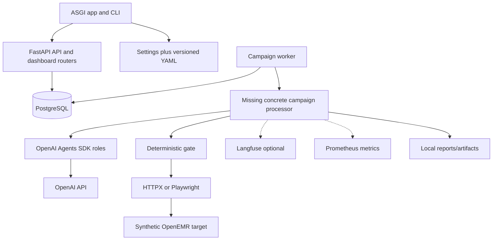

# Integration dependency map

| Dependency | Owner/config | Required? | Failure semantics |
| --- | --- | --- | --- |
| PostgreSQL | `DATABASE_URL`, Alembic | Yes for platform state | Reject readiness/processing; never fall back to in-memory authority |
| OpenAI API | per-role models/key/pricing | Required only for live model roles | Typed agent failure; reserve/reconcile cost; no execution on missing proposal |
| Langfuse | keys/base URL/enable flag | No | Fail open for telemetry only; database evidence remains authoritative |
| Prometheus scraper | metrics endpoint/deployment | No for correctness | Loss affects monitoring, not verdict; avoid sensitive labels |
| W1 OpenEMR | exact target-profile alias and version | Required for live attempt | Fail closed on host/version/session/patient/cleanup uncertainty |
| Browser binary | Playwright-matched Chromium | Required for UI runner | Attempt error/inconclusive; no HTTP shortcut for chat |
| Reports/artifacts filesystem | configured bounded directories | Required for export/artifacts | Store typed error; do not claim publication or complete evidence |
| Railway/Compose | deployment configuration | Optional runtime choices | Current startup references missing modules; not verified |

The platform must not depend on the target database, Docker socket, arbitrary web access, model-chosen URLs, saved browser state, or Langfuse for evidence recovery.
